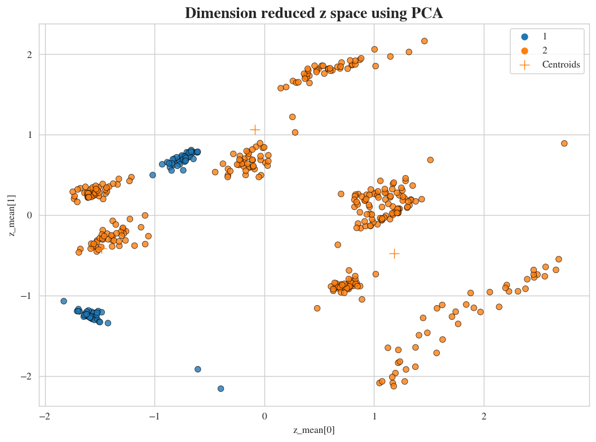
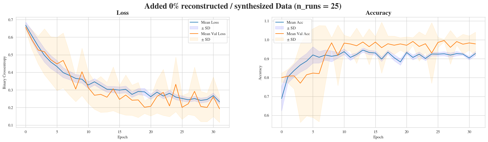

# About the Project
**Title**: ``Improve available classifiers through data augmention using generative AI``  
At the Chair of Information & Market Engineering (IISM) at Karlsruhe Institute of Technology.

Development of a Variational Autoencoder (VAE) to synthetically create realistic EEG data (multivariate time series). 
As for the data we used 10 sessions of one field study participant solving difficult math task, while 7 channels were
attached to his/her brain to collect EEG data. During the field study we surveyed the mental workload that serves as
our class labels (for the EEGNet). In this seminar, we have shown that by populating the training set *X_train* with
synthetical / reconstructed data from the VAE, it stabilizes the training and decreases the validation loss and also 
increases the validation accuracy (see figures below).

# Folder Structure 🗂️
```
📦biosignals-gen-ai
 ┣ 📂assets                    <-- Contains saved figures, ...
 ┣ 📂config                    <-- Configuration files for the pipeline
 ┣ 📂data                      <-- Provided data
 ┃ ┣ 📂raw                     <-- Contains the raw data provided by the supervisor
 ┃ ┗ 📂processed               <-- Contains the processed data
 ┣ 📂models                    <-- Saved models during Development
 ┣ 📂notebooks                 <-- Jupyter Notebooks used in development
 ┃ ┣ 💻data_loader.ipynb       <-- Experimenting of data loader class
 ┃ ┣ 💻eda.ipynb               <-- Exploratory Data Analysis Notebook
 ┃ ┣ 💻eegnet.ipynb            <-- Experimenting with EEGNet and my VAE
 ┃ ┗ 💻vae.ipynb               <-- Development of my VAE (Dense)
 ┣ 📂src                       <-- Source code / modules / classes
 ┣ 📂tests                     <-- Unit tests for the source code
 ┃ ┣ 📜dataloading.py          <-- Class that handles the data loading
 ┃ ┣ 📜eegnet.py               <-- Contains the EEGNet Architecture by Lawhern et al. 2016
 ┃ ┣ 📜modelling.py            <-- Contains helper function to analyse the modelling, e.g. history plots
 ┃ ┣ 📜preprocessing.py        <-- Class that handles the data preprocessing
 ┃ ┣ 📜utils.py                <-- Contains utility / helper functions
 ┃ ┣ 📜vae_base.py             <-- Abstract class of VAE
 ┃ ┣ 📜vae_conv.py             <-- Implementation of base VAE using Conv layers
 ┃ ┣ 📜vae_dense.py            <-- Implementation of base VAE using Dense layers
 ┃ ┗ 📜vae_lstm.py             <-- Implementation of base VAE using LSTM layers
 ┣ 🕹️main.py                   <-- Entry point of the pipeline
 ┣ 📜README.md                 <-- The top-level README for developers using this project
 ┗ 📜requirements.txt          <-- The requirenments file for reproducing the environment
```

# Setting up the environment and run the code
Note, due to time reasons, not everything is fully implemented yet. For the VAE / EEGNet, please refer to the corresponding 
notebooks found in `.notebooks/` dir.

1. Clone the repository by running the following command in your terminal:

   ```
   git clone https://github.com/negralessio/biosignals-gen-ai
   ```


2. Navigate to the project root directory by running the following command in your terminal:

   ```
   cd biosignals-gen-ai
   ```

3. [Optional] Create a virtual environment and activate it. For example, using the built-in `venv` module in Python:
   ```
   python3 -m venv venv
   source venv/bin/activate
   ```

4. Install the required packages by running the following command in your terminal:

   ```
   pip install -r requirements.txt
   ```

5. Place the data in the `data/raw` folder.

6. Run the pipeline with the following command:

   ```
   python3 main.py --config "configs/config.yaml"
   
# Findings
Below you can find the results of our VAE on the EEGNet. 
- Populating the train set with reconstructed / synthetic data decreases the validation loss and
- also stabilizes the training, especially in the context of low samples as we have here
## Learning Curves of the VAE


## Visualization of the 8D latent space using PCA


## Effect on the EEGNet



## Effect on the EEGNet: Table View

| % Synth. Added | Mean Loss | SD Loss | Mean Val Loss | SD Val Loss | Mean ACC | SD ACC | Mean Val ACC | SD Val ACC |
|:--------------:|-----------|---------|---------------|-------------|----------|--------|--------------|------------|
|       0%       | 0.2318    | 0.0129  | 0.1926        | 0.0777      | 0.9273   | 0.0113 | 0.9784       | 0.0625     |
|       25%      | 0.2934    | 0.0094  | 0.1789        | 0.0479      | 0.9130   | 0.0087 | 0.9942       | 0.0162     |
|       50%      | 0.2512    | 0.0158  | 0.1518        | 0.0461      | 0.9173   | 0.0111 | 0.9986       | 0.0039     |
|      100%      | 0.2101    | 0.0151  | 0.1420        | 0.0475      | 0.9524   | 0.0150 | 0.9956       | 0.0164     |

- Sweet Spot is 50% added reconstructed / synthetic data
- Generalization ability of EEGNet is improved